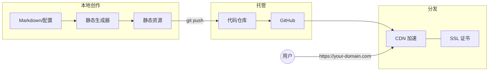

# 零成本打造高性能静态网站：GitHub Pages + Cloudflare 架构解析

想拥有一个属于自己的网站，展示作品、记录思考或建立个人品牌，但总被一些现实问题劝退：租用服务器价格不菲且需要运维，学习动态开发技术栈门槛太高，或者网站部署后国内访问速度慢如蜗牛。传统的虚拟主机或云服务器方案，在带来灵活性的同时，也带来了账单焦虑和安全维护负担。那么有没有一个轻量、成本低、性能高的方案呢？

静态网站生成器（SSG）技术是一个成熟的选择，通过预先生成的 HTML、CSS、JS 构成，无需数据库和后端。它具备极致性能（文件直接分发，加载极快）、更高安全性（无数据库和动态脚本注入攻击面）、以及近乎为零的部署成本（可依托免费托管平台）。

方案的核心组件如下：

- **静态站点生成器**（如 Hugo、Hexo、VitePress）：负责将 Markdown 内容转换为网页；
- **GitHub**：提供免费、稳定且与 Git 工作流深度集成的托管服务；
- **Cloudflare**：充当全球 CDN 和智能 DNS，解决跨境访问速度问题并提供免费 SSL 证书；以及自定义域名，完成个人品牌的最终塑造。

### 架构流程

将零成本、高性能和完全掌控权融为一体。GitHub提供了免费、自动化、工程化友好的托管基地；Cloudflare 赋予了其全球加速、一键安全与灵活的扩展能力；而静态站点生成器则让你能专注于内容创作。这尤其适合个人博客、作品集、项目文档等场景。

建立个人网站，不仅是技术实践，更是打造个人品牌的基石。它构成了完全可控的数字资产与专业展示窗口，内容沉淀的复利效应将随时间显现。
