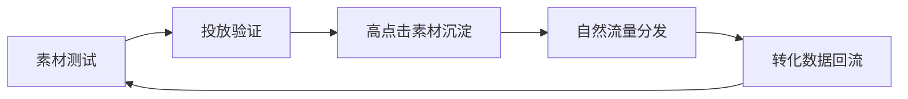

## 核心思路

- 付费流量负责“提速”
- 自然流量负责“放大利润”
- 两者共用同一套内容素材池

## 日常SOP

1. 每日筛选前一天 Top 10 素材
2. 按点击率和加购率做AB分组
3. 把高表现素材改写为自然流量版本
4. 每晚记录预算消耗和订单质量

## 指标看板

- 点击率（CTR）
- 加购率（ATC）
- 支付转化率（CVR）
- 广告花费回报（ROAS）

> [!NOTE]
> 别只看 ROAS，必须同时看退款率与客诉率。

## 排查清单

- [ ] 曝光高但点击低：主图或标题问题
- [ ] 点击高但转化低：详情页与人群不匹配
- [ ] 转化高但利润低：优惠策略过重

